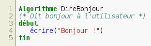
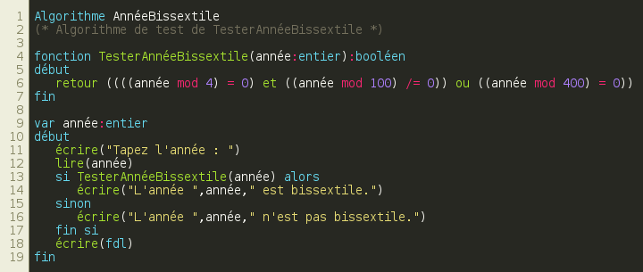

# pygments-algo-lexer

Un lexer pour un langage algorithmique français, à utiliser avec [Pygments](http://pygments.org/).

### Exemples de rendus





### Installation

#### Depuis le repository (instable)

```bash
pip install -r "https://raw.githubusercontent.com/tibounise/pygments-algo-lexer/master/requirements.txt"
pip install -UI -e "git+https://github.com/tibounise/pygments-algo-lexer.git#egg=pygments-algo-lexer"
```

#### Par release ("stable")

```bash
pip install https://github.com/tibounise/pygments-algo-lexer/archive/v1.0.1.tar.gz
```

### Utilisation

#### Avec `pygmentize`

Le lexer `pygments-algo-lexer` est associé à l'extension de fichiers `.alg`. Il suffit alors de passer le fichier à colorer de la manière suivante :

```
pygmentize direbonjour.alg
```

#### Dans un rapport LaTeX

Pour inclure un algorithme dans un rapport LaTeX, on peut utiliser le package [minted](https://github.com/gpoore/minted). minted utilisant en interne Pygments, on peut donc utiliser `pygments-algo-lexer` comme lexer :

```latex
\usepackage{minted}

...

\begin{minted}{algo}
Algorithme DireBonjour
(* Dit bonjour à l'utilisateur *)
début
   écrire("Bonjour !")
fin
\end{minted}
```

### Merci l'opensource

Ce lexer est basé sur le projet [pygments-github-lexer](https://github.com/liluo/pygments-github-lexers).
